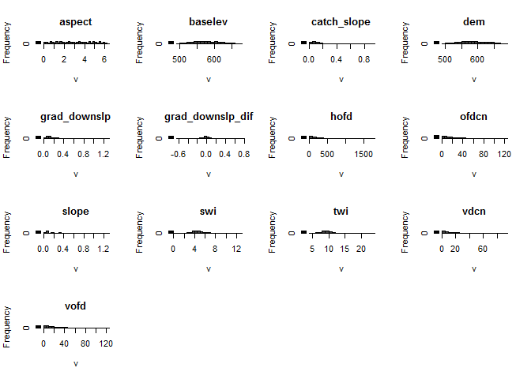
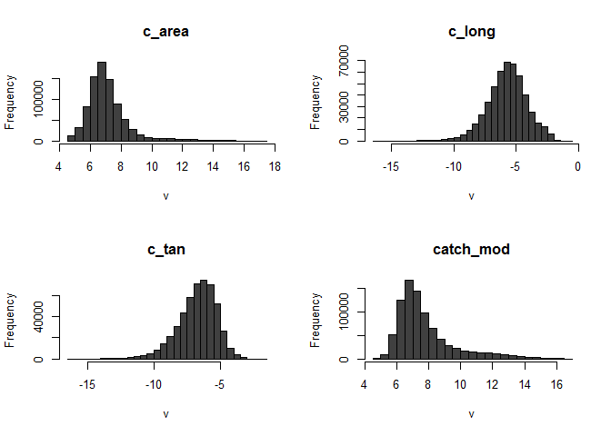
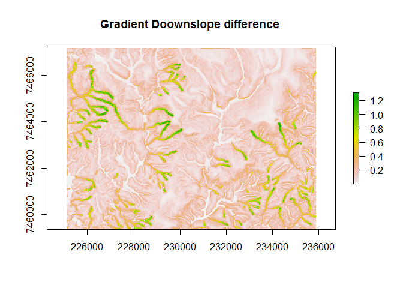

Geomophological units
================
VCL
August 29, 2018

Teste
-----

Parâmetros do terreno SAGA V.2.2.3

``` r
#setwd("c:/geom")
list.files (pattern = '^.*\\.asc$') #listando todos os arquivos .asc
```

    ##  [1] "aspect.asc"           "baselev.asc"          "c_area.asc"          
    ##  [4] "c_long.asc"           "c_tan.asc"            "catch_mod.asc"       
    ##  [7] "catch_slope.asc"      "dem.asc"              "fdir.asc"            
    ## [10] "grad_downslp.asc"     "grad_downslp_dif.asc" "hofd.asc"            
    ## [13] "ofdcn.asc"            "slope.asc"            "swi.asc"             
    ## [16] "twi.asc"              "vdcn.asc"             "vofd.asc"

``` r
TP.list <- list.files(getwd(), pattern= '^.*\\.asc$', full.names = TRUE) #arquivos de extens?o asc
TP.list <- TP.list [-9]     #Retirando o Flow Direction
TP.list
```

    ##  [1] "C:/projetosR/geomorph/aspect.asc"          
    ##  [2] "C:/projetosR/geomorph/baselev.asc"         
    ##  [3] "C:/projetosR/geomorph/c_area.asc"          
    ##  [4] "C:/projetosR/geomorph/c_long.asc"          
    ##  [5] "C:/projetosR/geomorph/c_tan.asc"           
    ##  [6] "C:/projetosR/geomorph/catch_mod.asc"       
    ##  [7] "C:/projetosR/geomorph/catch_slope.asc"     
    ##  [8] "C:/projetosR/geomorph/dem.asc"             
    ##  [9] "C:/projetosR/geomorph/grad_downslp.asc"    
    ## [10] "C:/projetosR/geomorph/grad_downslp_dif.asc"
    ## [11] "C:/projetosR/geomorph/hofd.asc"            
    ## [12] "C:/projetosR/geomorph/ofdcn.asc"           
    ## [13] "C:/projetosR/geomorph/slope.asc"           
    ## [14] "C:/projetosR/geomorph/swi.asc"             
    ## [15] "C:/projetosR/geomorph/twi.asc"             
    ## [16] "C:/projetosR/geomorph/vdcn.asc"            
    ## [17] "C:/projetosR/geomorph/vofd.asc"

``` r
grids5m <- raster::stack(TP.list)
class(grids5m)
```

    ## [1] "RasterStack"
    ## attr(,"package")
    ## [1] "raster"

``` r
summary (grids5m)
```

    ##      Length       Class        Mode 
    ##    14417598 RasterStack          S4

**Resumo dos dados**
--------------------

Parâmetros SAGA:

<table>
<colgroup>
<col width="22%" />
<col width="33%" />
<col width="33%" />
<col width="9%" />
</colgroup>
<thead>
<tr class="header">
<th>Dataset</th>
<th>Descrição</th>
<th>Método</th>
<th>Unidade</th>
</tr>
</thead>
<tbody>
<tr class="odd">
<td>&quot;aspect.asc&quot;</td>
<td>Aspecto</td>
<td>Evans, 1979 (2nd order polynom)</td>
<td>Radians</td>
</tr>
<tr class="even">
<td>&quot;baselev.asc&quot;</td>
<td>Elevaçãoo do nível de base</td>
<td>ta_channels SAGA V2.2.3^*^</td>
<td>m</td>
</tr>
<tr class="odd">
<td>&quot;c_area.asc&quot;</td>
<td>Área de contribuição dwonslope</td>
<td>Freeman 1994 (multiple direction)</td>
<td>m<sup>2</sup></td>
</tr>
<tr class="even">
<td>&quot;c_long.asc&quot;</td>
<td>Curvatura longitudinal</td>
<td>Evans, 1979 (2nd order polynom)</td>
<td>Normalized</td>
</tr>
<tr class="odd">
<td>&quot;c_tan.asc&quot;</td>
<td>Curvatura Tangencial</td>
<td>Evans, 1979 (2nd order polynom)</td>
<td>Normalized</td>
</tr>
<tr class="even">
<td>&quot;dem.asc&quot;</td>
<td>Modelo digital de elevação</td>
<td>Hutchinson, 1996 (ANUDEM)</td>
<td>m</td>
</tr>
<tr class="odd">
<td>&quot;slope.asc&quot;</td>
<td>Declividade</td>
<td>Evans 1979 (2nd order polynom)</td>
<td>Radians</td>
</tr>
<tr class="even">
<td>&quot;grad_downslp.asc&quot;</td>
<td>Gradient downslope distance</td>
<td>Hjerdt et.al, 2004</td>
<td>degree</td>
</tr>
<tr class="odd">
<td>&quot;grad_downslp_dif.asc&quot;</td>
<td>(grad_downslp.asc - slope.asc)</td>
<td>Hjerdt et.al, 2004</td>
<td>degree</td>
</tr>
<tr class="even">
<td>&quot;hofd.asc&quot;</td>
<td>Horizontal overland flow distance</td>
<td>Nobre, 2011 (Nearest Drainage)</td>
<td>m</td>
</tr>
<tr class="odd">
<td>&quot;ofdcn.asc&quot;</td>
<td>Overland flow distance to channel</td>
<td>Nobre, 2011 (Nearest Drainage)</td>
<td>m</td>
</tr>
<tr class="even">
<td>&quot;vdcn.asc&quot;</td>
<td>Vertical distance to channel</td>
<td>ta_channels SAGA V2.2.3^*^</td>
<td>m</td>
</tr>
<tr class="odd">
<td>&quot;vofd.asc&quot;</td>
<td>Vertical overland flow distance</td>
<td>Nobre, 2011 (Nearest Drainage)</td>
<td>m</td>
</tr>
</tbody>
</table>

\*\*^\*^\*\*: This module calculates the vertical distance to a channel network base level. The algorithm consists of two major steps: 1. Interpolation of a channel network base level elevation 2. Subtraction of this base level from the original elevations. Author: O.Conrad (c) 2002





Including Plots
---------------

Plot Raster object:

``` r
plot(grids5m[[9]], main ="Gradient Doownslope difference ")
```


